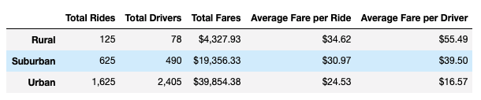
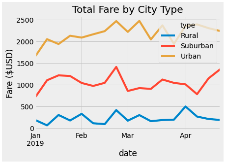

# PyBer_Analysis

## Overview of the analysis:
To detect trends, correlations and outliers we used the [city data](Resources/city_data.csv) and [ride_data](Resources/ride_data.csv) to create a riding summary by city type (Urban, Suburban, Rural). The summary compares number of rides, number of drivers, fares, as well as averages for fares and drivers.

 

Additionally, we compared the fare totals on a weekly basis from January through April 2019 for each city type. 

## Results
- Urban city rides had 2.6 times the number of Suburban rides and 13 times the number of Rural rides.
- Urban cities have a significantly higher number of drivers. It has 30 times the number of drivers in Rural cities and approximately 5 times the number of drivers in Suburban cities.
- Rural cities have a higher average fare per ride of over 3 times the total in Urban cities and about 1.5 the total of Suburban cities. 
- The average fare per ride for Urban cities was over 9 times that or Rural cities and over twice the average fare per ride in Suburban cities. 
- Between February and March, all city types experienced a surge in fares.
- Between January and February all city types experienced a decrease in fare rides. 

## Summary
In order to make rides and fares more equitable to both riders and drivers across city types, the following changes are recommended:
- Increase the number of drivers in Rural and Suburban areas by offering an incentive to drivers in those areas.
- Develop and implement a ride sharing protocol to allow drivers tp pick up multiple riders in rural areas that are able to share the cost of the ride to decrease the average cost per ride.
- Provide an upper limit on average fares per ride to keep fares within a range, particularly for Rural areas. 
